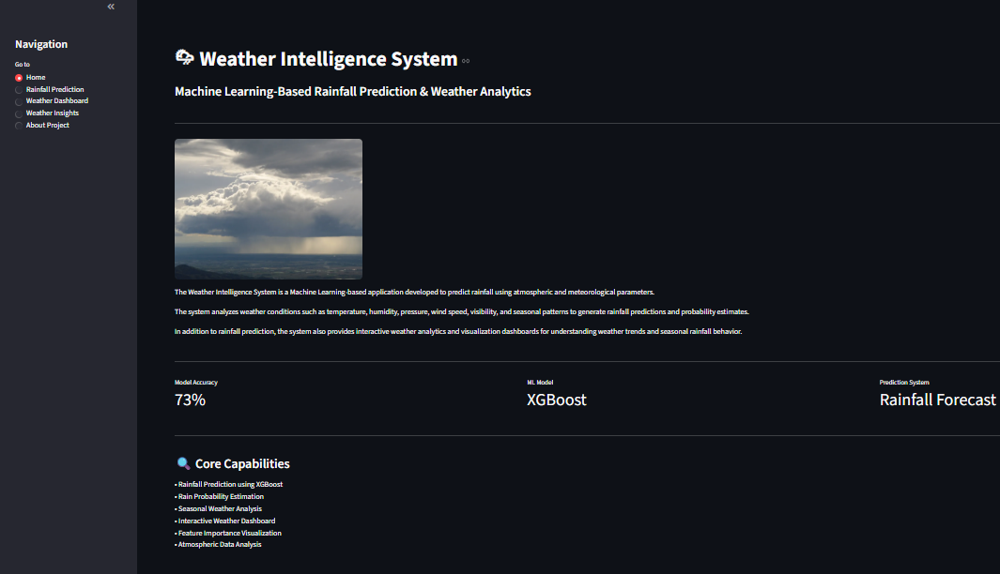
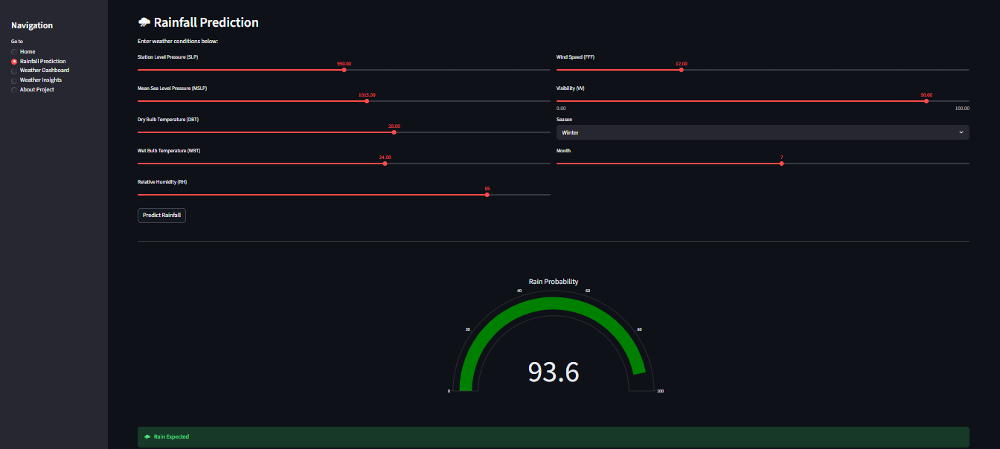
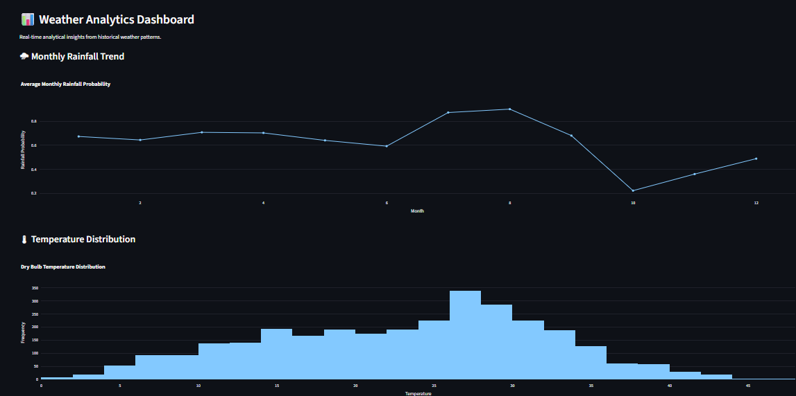
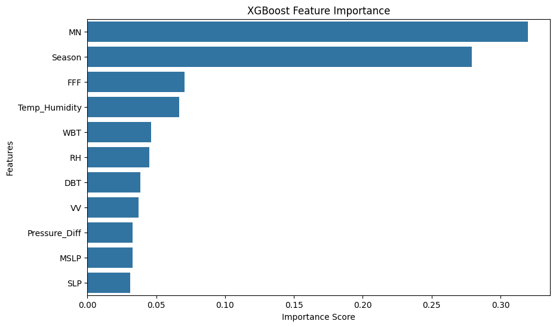

# 🌧️ Weather Intelligence System (Machine Learning Project)


## Problem Statement:
Accurate rainfall prediction is essential for agriculture, transportation planning, and disaster preparedness. Traditional weather analysis methods fail to capture complex relationships between atmospheric variables, leading to unreliable forecasts.

This project uses Machine Learning to improve rainfall prediction using real-world meteorological data.

## Solution Overview
The Weather Intelligence System is an end-to-end machine learning web application that predicts rainfall probability based on atmospheric conditions and provides interactive weather analytics.
git add .
It combines:
- Machine Learning Models
- Feature Engineering
- Data Visualization
- Interactive Streamlit Dashboard


##  Key Features
-  Rainfall prediction using ML models
-  Interactive weather analytics dashboard
-  Risk level classification (Low / Moderate / High)
-  Feature correlation analysis
-  Feature importance visualization
-  Seasonal weather pattern analysis
-  End-to-end machine learning pipeline with deployment-ready app

##  Machine Learning Approach
Supervised learning models were trained and compared:

- Logistic Regression  
- Random Forest  
- Support Vector Machine (SVM)  
- Stacking Classifier  
- XGBoost (Final Model)


##  Dataset & Target Variable
- Target Variable: Rainfall (0 = No Rain, 1 = Rain)
- Dataset: The model is trained on a real-world weather dataset. A cleaned sample dataset is included in the repository for demonstration and deployment purposes.
- Type: Supervised Classification Problem


## Features Considered
- Atmospheric Pressure (SLP, MSLP)
- Temperature (DBT, WBT)
- Humidity (RH)
- Wind Speed (FFF)
- Visibility (VV)
- Seasonal Patterns
- Month of Observation (MN)


## Steps Performed
- Data Cleaning & Preprocessing
- Feature Engineering (Season, interactions)
- Model Training (Logistic, RF, SVM, XGBoost, Stacking)
- Model Evaluation (Accuracy, Precision, Recall)
- Final Model Selection (XGBoost)
- Deployment using Streamlit


###  Final Model Performance:
- Accuracy: ~73%
- Optimized using feature engineering and tuning


## Feature Engineering
Key engineered features:
- Temperature–Humidity interaction
- Pressure difference
- Seasonal encoding
- Weather-derived transformations


##  Technologies Used
- Python  
- Streamlit  
- Pandas, NumPy  
- Scikit-learn  
- XGBoost  
- Plotly  
- Matplotlib, Seaborn


## Project Screenshots

###  Home Page

###  Prediction Page

###  Dashboard

### Feature Importance



## 📁 Project Structure
```
Weather-Intelligence-System/
│
├── app.py
├── dataset/
│ └── weather_sample.csv
├── models/
│ ├── weather_xgboost_model.joblib
│ └── feature.joblib
├── images/
├── requirements.txt
└── .gitignore
```

## How to Run Locally

```bash
git clone https://github.com/gurpreet2007/Weather-Intelligence-System.git
cd Weather-Intelligence-System
pip install -r requirements.txt
streamlit run app.py
```


##  Future Improvements
- Live weather API integration  
- Real-time forecasting  
- Multi-day prediction system  
- Cloud deployment enhancements

  
## About Me
Electronics and Computer Engineering undergraduate with strong interest in Machine Learning, Data Science, and Software Development. Experienced in building end-to-end ML projects involving data preprocessing, model training, and deployment using Streamlit. Skilled in Python, Java, and working with real-world datasets.

## 🌐 Live Demo
👉 [Click here to open the app](https://weather-intelligence-system-li30.onrender.com/)